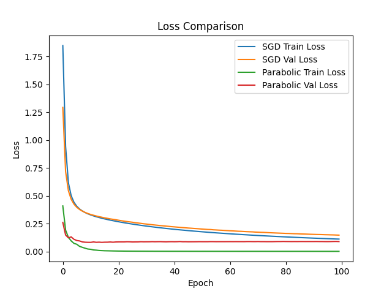
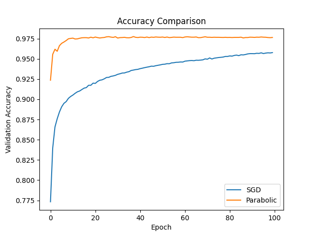

# Math For AI - Lab 01 - Neuron Network - Optimizer

## 1. Introduction

- This project is the lab 01 of the "Math in AI" subject. It aims to learn about the neuron network architecture, the loss function, the optimizer function. Specially, we will try to replace the Gradient Descent to Parabolic Interpolation.

## 2. Simple Neuron Network Design

```python

self.hidden = nn.Linear(784, 128)
self.output = nn.Linear(128, 10)
self.relu = nn.ReLU()
```

- This is a simple neural network with several layers using the ReLU function. This architecture is capable of handling the MNIST classification problem.

## 3. Visualize Result

- About the loss



- About the accuracy



## 4. Conclusion

Experimentally, the Parabolic algorithm demonstrated superior performance compared to SGD in both accuracy and loss function.

Specifically, Parabolic achieved very high accuracy (~97.5%) after only a few epochs and quickly converged, while SGD increased more slowly and only reached about ~95.5% after 100 epochs. This indicates that Parabolic has a faster learning rate and a better ability to find optimal solutions in the parameter space.

Regarding the loss function, Parabolic reduced the loss very quickly and reached a near-minimum value (close to 0) much earlier than SGD. Meanwhile, SGD reduced the loss steadily but slowly and still had a gap compared to Parabolic at the end of the training process. At the same time, the gap between the training loss and the validation loss of Parabolic is small, indicating that the model has good generalizability and is less prone to overfitting.

In summary, Parabolic is a more efficient optimization method than SGD for this problem, especially in terms of convergence speed and the quality of the final solution. However, it should be noted that this efficiency may depend on the specific problem, the model architecture, and the choice of hyperparameters.

